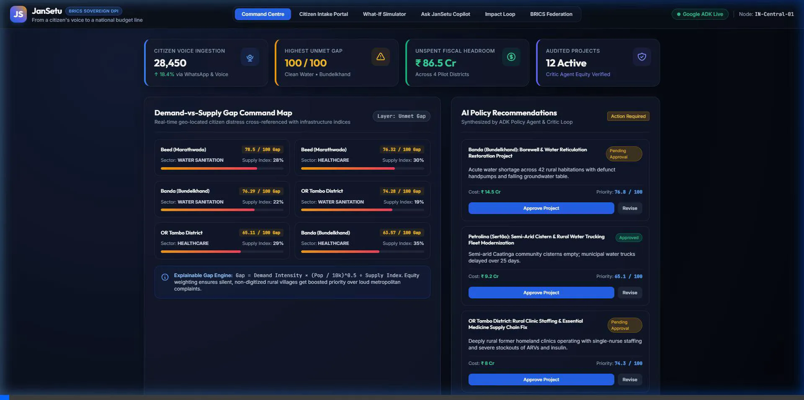

# JanSetu: Citizen-to-Policy Intelligence for BRICS
> *"From a citizen's voice to a national budget line."*

🌐 **Live Google Cloud Deployment:** [https://jansetu-518872797698.asia-south1.run.app](https://jansetu-518872797698.asia-south1.run.app)

JanSetu is a sovereign Digital Public Good (DPG) that turns citizen grievances across BRICS languages and dialects into evidence-backed, explainable development priorities, compares demand against infrastructure supply and budgets, and measures whether resulting investments worked.

---

## 📹 Working Demo Video

A full session walkthrough demonstrating the Google ADK Multi-Agent pipeline, What-If simulation, Copilot, and Command Centre is available in [`media/jansetu_demo_walkthrough.webp`](media/jansetu_demo_walkthrough.webp):



---

## 🏛️ What Was Built

Following the specification in [`PLAN.md`](PLAN.md), the repository contains an end-to-end, runnable implementation:

```
JanSetu/
├── apps/
│   ├── agents/                   # Google Agent Development Kit (ADK) Agents
│   │   ├── agent.py              # ADK entry point exposing root_agent for `adk run` & `adk web`
│   │   ├── agents.py             # Individual ADK agents (Intake, Language, Classifier, Geo, etc.)
│   │   ├── tools.py              # Python tools for transcription, geo-resolution, scoring, & bias audits
│   │   ├── schemas.py            # Pydantic structured schemas for agent inputs and outputs
│   │   └── pipeline.py           # Multi-agent orchestrator with live Gemini & offline fallback
│   ├── api/                      # FastAPI Master Gateway
│   │   ├── main.py               # Server startup, CORS, and static asset router
│   │   ├── schemas.py            # API request/response models
│   │   ├── services.py           # Simulation engine, Copilot QA, and recommendation storage
│   │   ├── static/index.html     # Policymaker Command Centre & Citizen Intake Portal
│   │   └── routers/              # Modular REST routers (intake, analytics, recommendations, simulation, copilot, impact, federation)
├── packages/
│   ├── taxonomy/                 # UN SDG-aligned development taxonomy with multilingual support
│   ├── scoring/                  # Transparent, unit-tested Gap & Priority Scoring algorithms
│   └── connectors/               # Sovereign country data connectors for BRICS administrative units
├── data/seeds/
│   └── brics_data.json           # Pilot data for India, Brazil, South Africa, and BRICS nodes
├── tests/
│   └── test_jansetu.py           # Full pytest test suite (100% passing)
├── .env.example                  # Environment configuration template
└── PLAN.md                       # Comprehensive architectural blueprint
```

---

## 🤖 Google Agent Development Kit (ADK) Architecture

Built on Google's official open-source **Agent Development Kit (`google-adk`)**, JanSetu utilizes code-first multi-agent orchestration:

```
                       ┌─────────────────────────────┐
                       │ JanSetu Orchestrator Agent  │ (ADK root_agent in agent.py)
                       └──────────────┬──────────────┘
      ┌─────────────┬─────────────────┼─────────────────┬─────────────┐
      ▼             ▼                 ▼                 ▼             ▼
Intake Agent  Language Agent  Classifier Agent     Geo Agent     Analyst Agent
(Audio/Text)  (Dialect/Pivot) (UN SDG Pydantic)   (Boundaries)  (Gap/Priority)
      │                                                               │
      └───────────────────────────────┬───────────────────────────────┘
                                      ▼
                        Policy Drafting Agent
                                      │
                                      ▼
                      Critic / Bias Auditor Agent  (LoopAgent audit)
                                      │
                                      ▼
                          Citizen Feedback Agent   (Native language SMS)
```

### Key ADK Concepts Implemented
1. **`root_agent` in `apps/agents/agent.py`**: Allows direct CLI execution with the official `adk run apps/agents` and visual inspection via `adk web`.
2. **Pydantic Structured Output**: Agents (like `Classifier Agent`, `Recommendation Agent`, and `Critic Agent`) enforce typed schemas on LLM outputs.
3. **Deterministic Tools**: Agents call standard Python functions (`compute_gap_and_priority_tool`, `geo_resolve_tool`, `audit_bias_and_equity_tool`).
4. **Dual Execution Engine**:
   - When `GEMINI_API_KEY` is present, executes live Gemini models via Google ADK.
   - When in offline/demo mode, seamlessly uses deterministic local fallback engines so all tests and UI flows run without subscription blockers.

---

## 🧮 Mathematical Scoring Formulas

### 1. Demand-vs-Supply Gap Score (0–100)
$$\text{Gap Score} = \text{Demand Intensity} \times 10.0 \times (1.0 - \text{Supply Index}) \times \text{Population Factor}$$

- **Demand Intensity**: Normalized from citizen grievance volume and urgency (1.0 to 10.0).
- **Supply Index**: Current physical infrastructure availability (0.0 = no infrastructure, 1.0 = fully saturated).
- **Population Factor**: Dampened square-root factor $(\text{Pop} / 10^6)^{0.3}$ to balance large districts with remote rural hamlets.

### 2. Explainable Priority Score (0–100)
$$\text{Priority Score} = \text{Gap Score} \times \text{Urgency Weight} \times \text{Equity Weight} \times \text{Feasibility} \times \text{Budget Headroom Factor}$$

- **Equity Weight** (1.0 to 1.5): Proactively boosts silent, low-connectivity rural habitations to counteract digital-divide bias.
- **Budget Headroom Factor**: Computes unspent fiscal allocations to prioritize projects that can be deployed immediately without fiscal delay.

---

## 🚀 Quickstart Guide

### 1. Run Automated Test Suite
```bash
python -m pytest tests/test_jansetu.py -v
```

### 2. Run with Google ADK CLI
```bash
# Optional: Set your Gemini API Key
export GEMINI_API_KEY="your-gemini-api-key"

# Interactive CLI session
adk run apps/agents "Analyze water crisis in Tindwari, Banda"

# Or launch ADK's built-in web playground
adk web apps/agents
```

### 3. Launch JanSetu Web Command Centre & Citizen Intake Portal
```bash
python -m uvicorn apps.api.main:app --port 8000 --reload
```
Open **[http://127.0.0.1:8000](http://127.0.0.1:8000)** in your browser:
- **Command Centre**: View live hotspot maps and review/approve AI project recommendations.
- **Citizen Intake Portal**: Test voice notes in Bundeli/Hindi, Hinglish, Portuguese, and South African English with live 8-stage ADK pipeline telemetry.
- **What-If Simulator**: Adjust capital outlays to model supply curve shifts and gap reductions.
- **Ask JanSetu Copilot**: Conversational AI answering grounded questions with citations.
- **Impact Loop**: Track before/after project delivery indicators (complaint drops, sentiment turnaround).
- **BRICS Federation**: Sovereign nodes and privacy-compliant data-sharing laws (DPDP, LGPD, POPIA).

---

## 🔒 Responsible AI & Sovereign Compliance
- **Consent & Purpose Limitation**: Configured per BRICS sovereign node.
- **Privacy Laws Supported**: India's **DPDP Act (2023)**, Brazil's **LGPD**, South Africa's **POPIA**, and Russia's **152-FZ**.
- **Human-in-the-Loop**: AI synthesizes recommendations, but government officials retain final approval authority with full audit trails.
